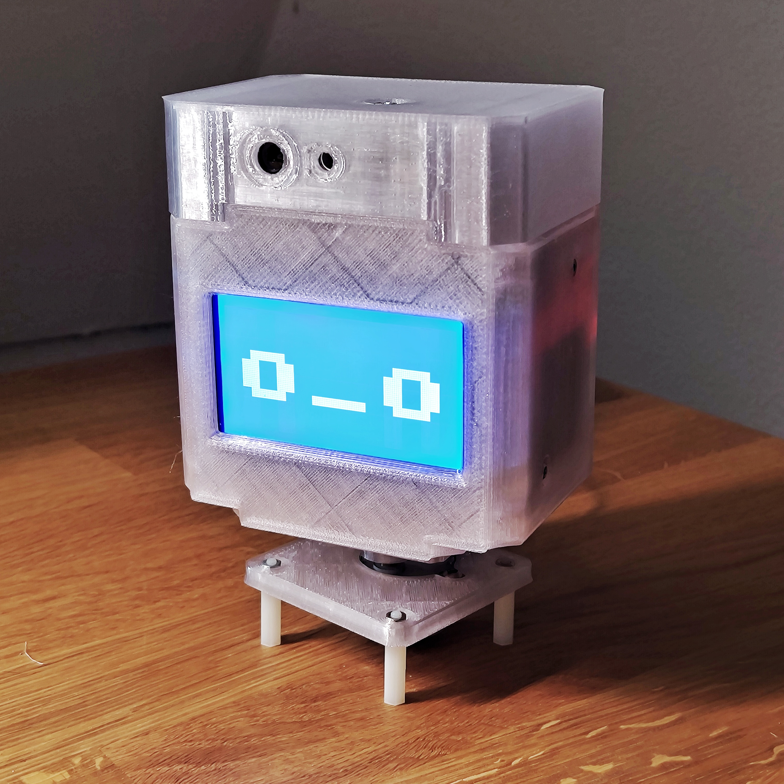
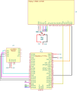

# rEmotion

rEmotion is a hardware module with a robotic application in mind. The module represents a head with a display and a camera alowing a robot to see the environment and express facial emotions.

The project consists of the two parts - the module and the library. The module is a hardware part with a display and a camera. The library is a software part that provides an API to control the module.

- Build manual: https://www.hackster.io/an-dr/0e8301
- Blog: https://hackaday.io/project/196438
- Mechanical parts: https://www.printables.com/model/1004766

## Documentation

- [Architecture](docs/architecture.md)
- TBD: Linux library API

## Hardware

