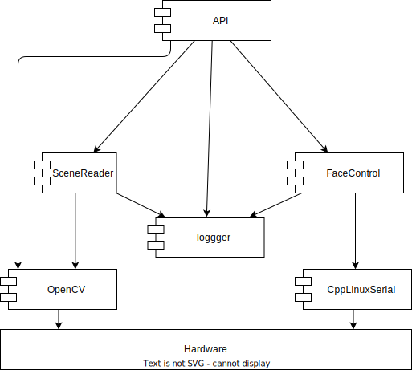

# 1. Architecture

## SPA Introduction

This document is written using [Small Project Architecture (SPA)](https://github.com/an-dr/spa) framework. A framework that keeps the quality high and the project fun.

Friendly Reminder:

> A good architecture makes the system easy to change, in all the ways that it must change, by leaving options open.
> *Robert C. Martin, Clean Architecture*

## 1.1. Project Description

rEmotion is a hardware module with a robotic application in mind. The module represents a head with a display and a camera alowing a robot to see the environment and express facial emotions.

## 1.2. Target Users

- Robot developers and enthusiasts
- Researches requiring visual input and output

## 1.3. Use Cases

## 1.4. Key Architecture Decisions and Principles

The principles and values of the project that must not be violated:

- Programming language: C++
- Hardware:
    - 3D printed body
    - ST7920 display
- Firmware: Arduino + PlatformIO
- Software library: Linux

## 1.5. System

### 1.5.1 Documentation Structure

Documentation consists of 3 main parts:

1. Architecture
2. Build instructions
3. Linux library API

### 1.5.2 Testing Strategy

API is tested with unit tests. The hardware is tested manually.

### 1.5.3 Hardware Components / Deployment

The project consists of the two parts - the module and the library. The module is a hardware part with a display and a camera. The library is a software part that provides an API to control the module.

### 1.5.4 Software Structure

#### 1.5.4.a Firmware

The firmware is written in C++ using Arduino and PlatformIO. It uses a callback system to handle the events caused by the I2C communication. If the event is known the callback sets an appropriate emotion image on the display.

#### 1.5.4.b Library

The library is written in C++ using Linux. It provides an API to control the module. The API is a set of functions that can be used to select the emotion image on the display or to get the image from the camera.

For the communication between the library and the webcam, the OpenCV library is used. For UART communication, the library uses CppLinuxSerial.

### 1.5.5 System Conditions

TBD. Overall system conditions, e.g. Normal Operation, Fail State, etc.

### 1.5.6 Operational Logic

TBD. High level logic of the system, how the software comonets and the hardware components work with the users and in what conditions.
